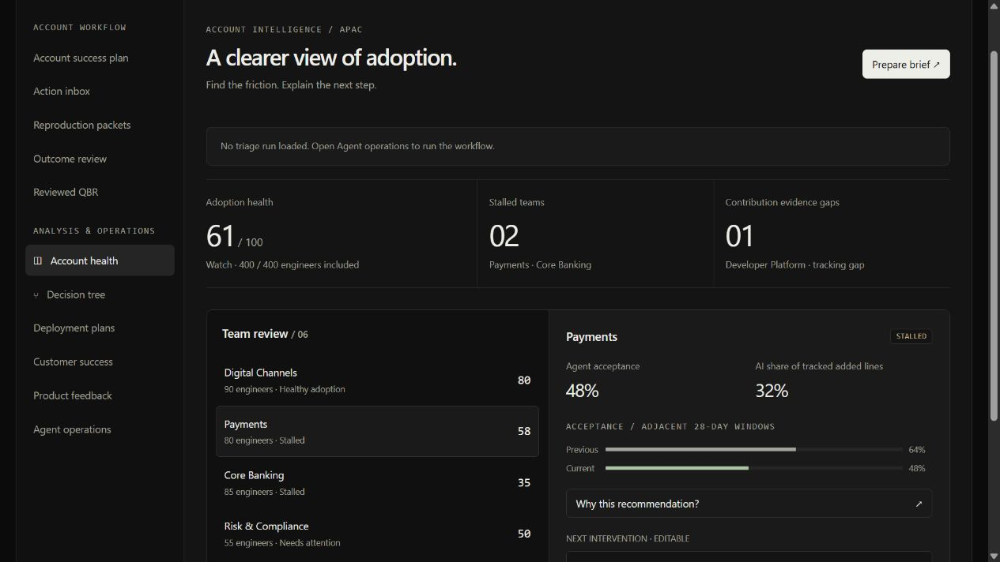

# Account health diagnostic

**Portfolio concept · V1 front-end prototype · synthetic data only**



## Run the V1 front-end prototype

**Complete account workflow:** Account success plan → Action inbox → Reproduction packets → Outcome review → Reviewed QBR. [Workflow guide](docs/complete-account-workflow.md). Reviews are local human attestations; changes to outcome evidence invalidate the related review and QBR approval. Internal discovery notes and reproduction details are excluded from generated QBR text.

**Agent operations:** a three-stage Python/SQLite workflow now triages the synthetic account, explains interventions and creates local draft tasks. See [framework and overnight CLI](docs/agent-framework.md). Offline mode needs no API key; model-assisted reviewers are optional and unverified against a live model.

The internal MVP now includes **Deployment plans**, **Customer success**, and **Product feedback**. See [features, metric definitions and demo](docs/internal-mvp.md). New records and results persist locally; simulated records are separate from Provider API fixtures. No external integrations are connected.

Requires Node.js 22+ and Python 3.12+ for agent operations. The offline demo needs no packages or API keys. See [setup, demo script and publishing boundaries](docs/sharing.md).

**Connectors:** use the bottom-left entry. Provider Admin access can be checked using a server-side `TELEMETRY_API_KEY`. The limited MCP check uses `SIGNAL_MCP_URL` (HTTPS) and optional `SIGNAL_MCP_TOKEN`, with JSON initialization responses for protocol 2025-06-18. Restart the server after configuring environment variables. Never commit credentials. These checks do not ingest data or execute MCP tools. CRM, Team chat, support and tracker controls are demo-only. OAuth and a full MCP SDK transport adapter remain planned.

Connection reference: [MCP transport specification](https://modelcontextprotocol.io/specification/2025-06-18/basic/transports).

```sh
npm start
```

Open [the prototype](http://127.0.0.1:4173) or [the screen sketch](http://127.0.0.1:4173/sketch.html). Run `npm test` for diagnostic rule checks.

The prototype includes team selection, a decision tree with missing-evidence scenarios, locally saved intervention edits, dark/light appearance, and a CTO brief with text download and browser printing. Source lives in `prototype/`. Edits are saved in this browser on this origin. What-if scenarios apply only to the decision-tree screen; the overview and QBR retain original scenario metrics.

This is **V1 of the front-end prototype**, not completion of the full V1 portfolio release below. It uses illustrative aggregates rather than API-shaped raw fixtures. Backend ingestion, SQL, 90-day generation, automated narrative validation and the Model integration remain planned. Long edited actions may span multiple printed pages; final one-page export layout remains future work.

An explainable customer-success diagnostic for **Example customer**, a fictional APAC bank with 400 engineers across six teams. The proposed product turns 90 days of Provider telemetry into team interventions and a one-page CTO QBR. It measures adoption and contribution signals, not causal productivity gains.

**Planned stack: Python, SQL, Model API integration.** Python owns ingestion, validation and rules; DuckDB SQL owns repeatable metrics; a Model narrative adapter drafts the QBR from approved evidence. A FastAPI backend and lightweight editable web UI are proposed for V1. The current Node server bridges to the Python/SQLite workflow and performs limited connection probes; the proposed ingestion backend is not yet implemented.

## Review this first

- [Solution, MVP, V1 and V2](docs/solution-draft.md)
- [Current architecture and agent walkthrough](docs/runtime-architecture.md)
- [Planned ingestion architecture](docs/architecture.md)
- [Explainable decision tree and worked example](docs/decision-tree.md)
- [Metric definitions and scoring proposal](docs/metric-contract.md)
- [Illustrative CTO QBR](docs/qbr-draft.md)

The local prototype lets you select teams, adjust illustrative metrics, edit interventions and preview the QBR. Its values are design fixtures, **not** output from a 90-day generator. All scoring thresholds are proposed assumptions for review.

## What makes this a portfolio piece

The case study should demonstrate API contract discipline, reproducible SQL, explicit metric tradeoffs, evidence-backed recommendations, and restraint around causal claims. Its central question is: **Where should the customer-success team intervene next, and what evidence would justify that action?**

## Delivery stages

| Stage | Deliverable | Exit condition |
|---|---|---|
| Draft — current | Product approach, architecture, metric contract, interactive design, sample QBR | Review navigation, scoring philosophy and scope |
| MVP | Seeded 400-user / 90-day generator; documented response envelopes; fixture client; DuckDB pipeline; rules; local dashboard; deterministic one-page QBR | Offline end-to-end run with traceable numbers and six recommendations |
| V1 | Portfolio release: polished UI, evidence drill-down, Model narrative adapter, exports, contract tests, CI, demo script | Reviewer can reproduce results and audit a QBR claim |
| V2 | Live enterprise adapter, scheduled ingestion, historical team membership, intervention follow-up, optional delivery-quality data | Authorized live integration passes the same contracts; no unsupported causal claims |

## API boundaries

The reusable source categories are member administration, usage analytics and AI code attribution. Access requirements and response schemas depend on the selected provider. The bundled connection probe targets one specific provider; neutral labels do not make it a universal connector. Its endpoint and authentication implementation remain in `prototype/connections.mjs`.

Schema fidelity, complete 90-day fixtures and live ingestion remain future acceptance criteria. Each provider adapter must pin source documentation and validate its contracts. The optional model SDK retains its actual dependency and environment names in `agents/requirements.txt` and `agents/model_agents.py`.

No paid API calls, deployment, or production ingestion have been performed.
