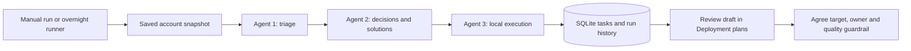

# Three-agent framework

The local MVP executes three bounded Python workers in order, stores their handoffs in SQLite, and exposes the run and action history in Account workspace. Default mode is **deterministic offline**, not an LLM pretending to access connected systems.

| Agent | Reads | Produces | Allowed action |
|---|---|---|---|
| Customer triage | Synthetic telemetry, last submitted deployment/support snapshot | Account summary, team evidence, blockers and limitations | Read and summarize |
| Decision and solutions | Triage evidence | Traceable interventions and measurement-repair plans | Plan; no external execution |
| Internal execution | Validated plans | Deduplicated internal draft tasks | SQLite insert; no overwrite or external writes |



## Run

Start the existing web server and open **Agent operations → Run workflow**. The first run stores the current browser's internal workspace snapshot. Subsequent runs retain existing tasks by account/team/rule rather than overwriting human edits. A failure rolls back all task creation while retaining a failed-run record. The server rejects overlapping agent API operations; SQLite serializes CLI access.

Python 3 is required. `SIGNAL_PYTHON` can specify its executable; the local demo also recognizes a bundled Python runtime. No additional packages are needed for offline mode.

```sh
python agents/workflow.py history
python agents/workflow.py nightly
python -m unittest discover -s agents -p "test_*.py"
```

Nightly uses the latest successful snapshot. It **does not ingest new telemetry**. Every summary discloses the fixed synthetic observation window. Browser edits do not reach overnight work until a manual workflow run submits them. The web server/browser need not remain open for CLI runs; the computer and scheduled runner must be available. Schedule setup is separate from the workflow and is not enabled by this code.

## Optional model-assisted review

Install `agents/requirements.txt` in a dedicated environment, configure the SDK-specific API key environment variable (see `agents/model_agents.py`) and `SIGNAL_AGENT_MODEL`, then run `python agents/workflow.py nightly --model-assisted`. This uses three Agents SDK reviewers for triage narration, decision explanation and execution-policy review. Their structured outputs are explicitly unverified; they cannot change deterministic metrics, targets or actions. External tracing is disabled. Model credentials and dependencies are not configured by the local MVP; no paid calls have been made or end-to-end model behavior verified.

The model-assisted mode currently narrates, rather than dynamically selecting tools. The deployment architecture intentionally separates model commentary from the execution boundary.

## Execution boundaries

No Team chat messages, emails, CRM writes, source-code changes or MCP tool calls are implemented in the execution agent. A future live executor needs action-specific authorization, account-scoped tools, target validation and an audit trail. A connector access check is not authorization to act on that system.

Draft tasks have no agreed target, no measured outcome and no passed quality check. Importing a task opens an editor requiring a target and review date. Stored runs/tasks are under ignored `agents/state/`; retain/export the SQLite database if the demo history matters.

This is one fictional account. Multi-account tenancy, authenticated shared access, fresh data ingestion, retention controls and production scheduling remain future work.
