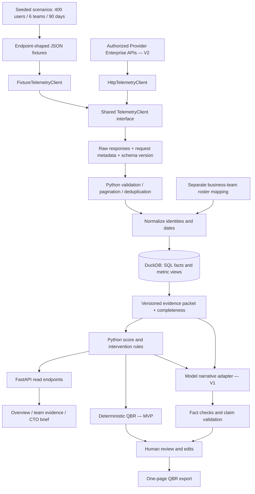

# Proposed architecture

The diagram above describes the planned ingestion and reporting pipeline, not the complete current implementation. See [current runtime architecture](runtime-architecture.md) for the working prototype, storage boundaries and human handoffs.

## Replaceable client

Proposed Python protocol methods: `members()`, `agent_edits(start, end, users)`, `tabs(start, end, users)`, `dau(start, end, users)`, and `commits(start, end, page, page_size)`. Return validated endpoint envelopes. Both adapters implement the same contract; the rest of the pipeline never branches on fixture versus live mode. Fixture reads simulate pagination and request filtering.

For MVP, request Analytics for each non-overlapping business-team user filter. This avoids pretending aggregate DAU can be split after ingestion. A Provider enterprise team and a bank engineering team are distinct concepts.

## SQL model

| Relation | Grain / responsibility |
|---|---|
| raw_responses | One request/page, payload hash, endpoint, parameters, retrieval time |
| dim_member | Provider identity; no fabricated business-team fields in raw response |
| team_membership | User + effective date range + business team; static in MVP |
| fact_agent_day | Business team + event date; diff counts |
| fact_tab_day | Business team + event date; suggestion/accept counts |
| fact_activity_day | Business team + date; DAU |
| fact_commit | Source identity including repo, hash, user and branch; attribution counts |
| metric_window | Team + window + metric definition version; numerator, denominator, value |
| quality_window | Completeness, unmatched identity count, late data and invalid rows |
| diagnostic_run | Rule version, seed/input hash, scores, evidence IDs and flags |
| intervention_override | Human action edits, owner, review date; separate from calculated evidence |

Reconcile commit uniqueness against the selected endpoint semantics before finalizing its key. Do not count the same source commit again because it appeared on another fetched page. Quarantine unmatched identities and invalid records; expose excluded counts.

## Source contracts to pin during MVP

| Endpoint | Envelope | Fields used |
|---|---|---|
| `GET /teams/members` | `teamMembers` | `id`, `email`, `name`, `role`, `isRemoved` |
| `GET /analytics/team/agent-edits` | `data`, `params` | `event_date`, `total_suggested_diffs`, `total_accepted_diffs` |
| `GET /analytics/team/tabs` | `data`, `params` | `event_date`, `total_suggestions`, `total_accepts` |
| `GET /analytics/team/dau` | `data`, `params` | `date`, `dau` |
| `GET /analytics/ai-code/commits` | `items`, `totalCount`, `page`, `pageSize` | user/repo/commit identity; added-line attribution; timestamps |

Preserve the documented additional fields, types, nullability and envelope values in each fixture. Snapshot documentation examples and annotate retrieval dates. Test request parameters, empty data, optional values and multi-page reads. Exact compliance is scoped to these selected endpoints and the pinned documentation version.

These endpoint shapes describe the original reference adapter, not a universal API standard. Exact source URLs remain in the integration implementation; each new provider requires a documented mapping and contract tests.
