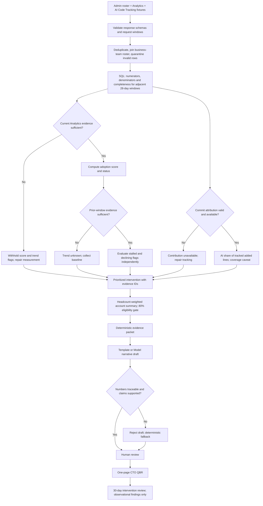
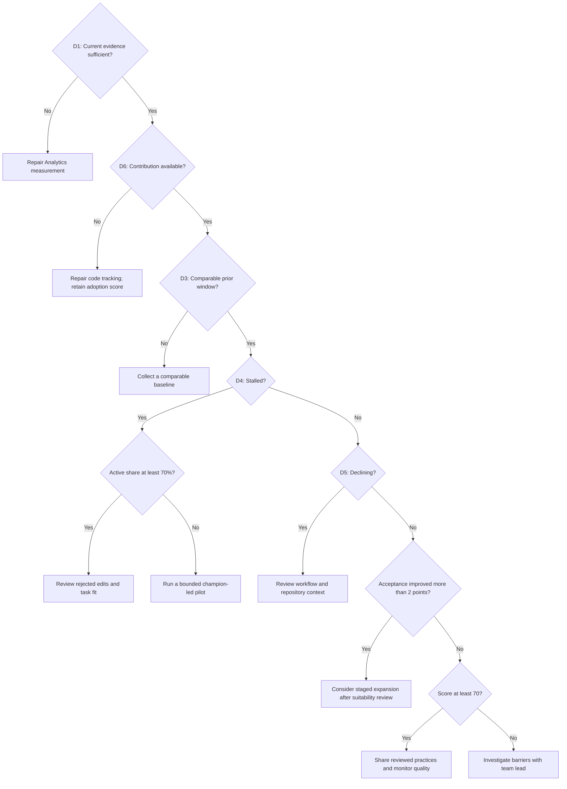

# Explainable diagnostic — decision tree draft

This is a proposed rule system, not a trained model or a causal explanation. Every result exposes the input values, rule ID, comparison, branch taken and evidence window. Thresholds are portfolio assumptions.

## End-to-end journey

## Rule decisions

| ID | Decision | Output |
|---|---|---|
| D0 | Valid schemas, identities and counts? | Quarantine invalid rows and surface exclusions before aggregation |
| D1 | At least 100 suggested diffs, 10 eligible working days, 90% expected Analytics responses, and valid nonzero denominators? | Otherwise withhold team score and trend flags |
| D2 | Current data passes D1? | Score = 0.7 × acceptance% + 0.3 × active-share%; ≥70 healthy, ≥50 watch, otherwise needs attention; classify before rounding |
| D3 | Prior window also passes D1? | Otherwise trend unknown; do not treat it as stable or improving |
| D4 | Current acceptance <55% AND change ≤+2 percentage points? | Stalled |
| D5 | Change ≤−10 percentage points? | Declining; may coexist with stalled |
| D6 | Valid tracked-commit attribution with nonzero added-line denominator? | Compute contribution share or mark unavailable; never alter adoption score |
| D7 | At least 80% of account headcount has an eligible score? | Headcount-weighted account score or withhold; always show included headcount |
| D8 | Draft numbers match evidence and claims stay within evidence? | Allow human review or fall back to template |

## Primary intervention tree

Evaluate from top to bottom; first matching rule selects the primary action. Other flags and secondary actions stay visible. This makes the earlier recommendation prose deterministic. The 70% active-share and +2-point improvement boundaries below are additional draft assumptions.

A team lead's policy or task-suitability information can modify an action, but must be recorded as human context, never inferred from usage. Risk & Compliance's policy discussion is such a context override. Each recommendation needs an owner, review date and success criterion.

## Worked example: Payments

Illustrative current window: 480 accepted / 1,000 suggested diffs = 48%; active share = 82%; prior acceptance = 64%; both windows pass evidence gates. Acceptance change = −16 points. Score = 33.6 + 24.6 = 58.2, displayed as 58, status Watch. Both stalled and declining flags fire. With contribution available, the stalled branch takes precedence; 82% active share routes to rejected-edit review. This is an investigation hypothesis, not proof of a cause.

Counterfactual: if only 80% of expected Analytics responses arrive, D1 fails. Score and flags become unavailable; the recommendation changes to measurement repair. If only commit tracking is missing, the adoption score remains 58, both flags remain, contribution becomes unavailable and tracking repair becomes the primary action.

## Interface requirement

Add “Why this recommendation?” beside every diagnostic. Open a trace with inputs → highlighted decision path → score arithmetic → independent flags → primary/secondary actions → permitted QBR claim. Show untaken branches too. A scenario selector should demonstrate missing current data, missing baseline, missing tracking and successful evidence. Mark all preview inputs synthetic.

This walkthrough expands the earlier static-metric design; neither preview is the implemented ingestion pipeline. A production audit record should additionally include raw response references, query/version hashes, rule version, timestamps and reviewer edits.
