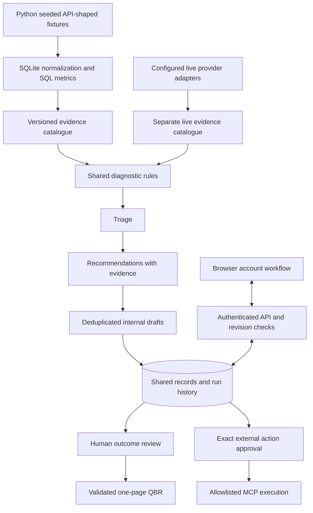

# Current runtime architecture

Three deterministic runtime workers support five human-led workflow features. Temporary implementation agents are coding assistants, not deployed services.

The local web server and hosted Worker use the same JavaScript diagnostic and persistence modules. Local storage is SQLite; hosted storage is D1 with generated migrations. Python owns reproducible data generation and SQL aggregation. Its earlier offline agent CLI remains available, but the web Agent operations screen now uses the shared runtime and database.

The five feature screens are success plan, action inbox, reproduction packet, outcome review and reviewed QBR. They connect by objective, deployment and feedback identifiers. Review records reference evidence snapshots. Changed content requires a new review; server audit timestamps do not change the approved content.

Workspace writes use revision checks to prevent silent overwrites. The hosted API requires platform identity and same-origin writes; local operation records `local-operator`. This is a single-account workspace, not enterprise tenancy or a complete role-based CRM.

Live snapshots and normalized evidence are stored separately from the synthetic account. Customer mapping and credentials are required; no live integration was verified during development. External tools require a configured endpoint, allowlist, exact approved arguments and explicit execution. Default mode is dry-run. Unknown outcomes are not retried automatically.

The nightly repository workflow runs at 02:00 Singapore and produces an offline artifact. It does not synchronize the hosted database or execute external actions. A separately configured environment can invoke the read-only live scheduling entry point. The fixed synthetic window remains disclosed in every offline run.

See [implementation status](implementation-status.md) and [live configuration](live-operations.md) for remaining limits.
