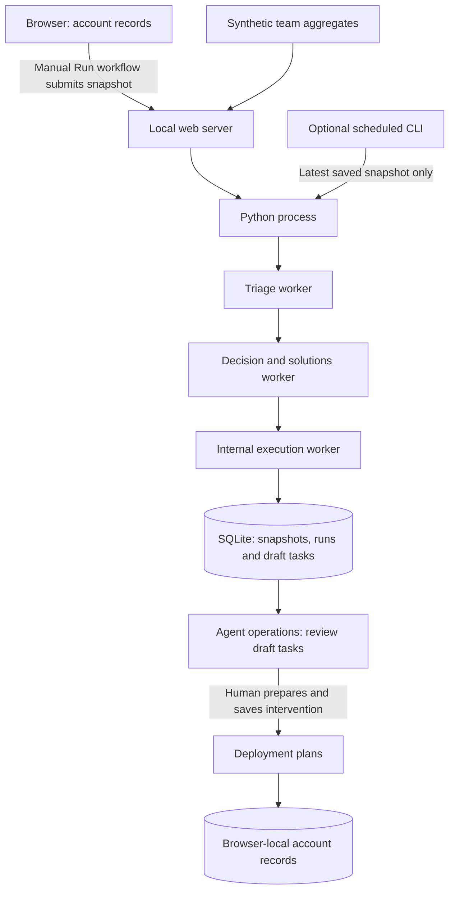
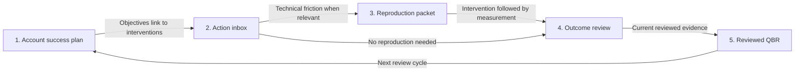

# How the working prototype fits together

There are three runtime workers and five account-workflow features. Temporary coding agents used during development are not deployed application services. The number of coding agents does not determine the runtime architecture.

## The three workers

| Worker | Input | Output | Boundary |
|---|---|---|---|
| 1. Customer triage | Synthetic team aggregates and submitted account records | Score, stalled teams, blockers, evidence limitations | Deterministic rules; no live ingestion |
| 2. Decision and solutions | Triage findings | Rule-based interventions, reasons and measurement-repair plans | Targets remain unagreed; recommendations are hypotheses |
| 3. Internal execution | Recommended plans | Deduplicated local draft tasks | No external messages, code changes or CRM writes |

One Python process runs these workers sequentially. They are not three independently hosted services. Optional model-assisted mode adds three narrative reviewers alongside the workers; it does not add three autonomous execution agents. That mode is unverified against a live model.

The nightly CLI exists, but no schedule is enabled. It reuses a saved snapshot; it cannot collect fresh usage or see subsequent browser edits until another manual run submits them.

## The five features form a human-led workflow

- The success plan records the customer's intended outcomes, sponsor and objectives.
- The action inbox derives outstanding work from interventions and feedback. It does not automatically consume unimported agent drafts.
- A reproduction packet links technical evidence to feedback and an intervention. It is optional for interventions without technical friction.
- Outcome review compares the recorded measurement with the target and quality guardrail. A human chooses collect evidence, expand, revise or stop.
- Reviewed QBR combines objectives and current reviewed observations into a draft. A human reviews the text before export. Changed evidence invalidates the approval.

Records connect through objective, deployment and feedback identifiers, not agent-to-agent conversations. Saving a screen does not automatically advance every other screen or send anything externally.

## Storage and integration boundaries

Account plans, interventions, feedback, reproduction packets, outcome reviews and QBR approvals live in browser local storage. Runtime snapshots, runs and draft tasks live in SQLite. These are two stores with explicit submission/import handoffs, not a synchronized shared CRM.

The developer-tool connector checks one bundled provider's Admin access. MCP performs a limited handshake. CRM, team chat, support and tracker connectors are simulations. Neutral connector names describe categories, not universal compatibility. Actual endpoint, SDK and dependency identifiers remain in implementation files so the adapters remain technically accurate.

The planned next architecture adds validated source adapters, normalized SQL metrics, fresh scheduled ingestion and shared authenticated persistence. See [planned data pipeline](architecture.md). Adoption and attribution remain diagnostic evidence, not proof of causal productivity gains.
